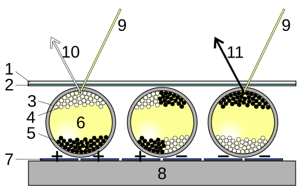
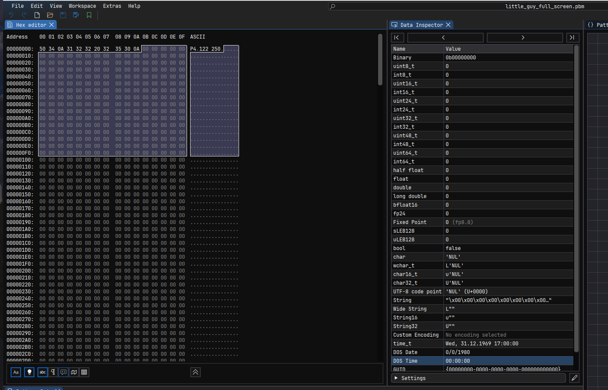

# Low Power EInk Homelab Monitor

I don't want more notifications and I won't have time to fix any homelab issues until after work.  

This project aims to provide a minimal display for monitoring homelabs that host non-critical systems. Instead of push notifications, it uses a small eink display to display homelab and hosted site status in a convieniet place. The pico pi and e-ink display combo can achive months long battery life. 

*[Finished Image To Come]*


## Usage

Setup:
```bash
git clone https://github.com/PrestonBlackburn/eink_homelab_monitor.git
git submodule update --init --recursive
export PICOTOOL_FETCH_FROM_GIT_PATH=./pico-sdk
```
*note: the wifi_config.cmake file is not in github*  
Create your own `wifi_config.cmake` file based on the `wifi_config.cmake.example` file
```cmake
set(WIFI_SSID "your_wifi_ssid")
set(WIFI_PASSWORD "your_wifi_password")
```

**Build**
from the root of the project:
```bash
cmake -DPICO_BOARD=pico_w -B build
make -C build
```

**Run the program**  
Move the `eink_monitor.uf2` to the pico pi (RPI-RP2 folder when plugged in)  

**View Logs (UART)**
(while in execute mode)
Find Device Name:
```bash
dmesg | grep tty
```
Connect To Read Logs:
```bash
sudo minicom -b 115200 -o -D /dev/ttyACM0
```

## Overview

There are a few main pieces to this library:
1. The wifi connection
2. HTTP requests to the server + NTP server
3. Using the deep sleep with the Pico
4. The Eink display setup


## Hardware
- Microcontroller - [Pico Pi W](https://www.raspberrypi.com/documentation/microcontrollers/pico-series.html)
- The Eink Display - [Waveshare ePaper 2.13inch](https://www.waveshare.com/wiki/Pico-ePaper-2.13)
- Power Supply - [Pico Pi UPS](https://www.waveshare.com/wiki/Pico-UPS-B)

### Pico Pi Wifi
Pico Pi vs Pico Pi W


IwIP Lib


### Pico Pi Deepsleep
<not implemented>  
Wasn't able to get this working, and I found out that for the lowest power setup you need an external trigger to wakeup the pico pi. I think this is the best solution, since the eink screen + flash memory can preserve the state. I think the difference should allow the pico to last for a little under a month on a small 500mAh battery.    

Example setup: https://ghubcoder.github.io/posts/waking-the-pico-external-trigger/

### Eink Waveshare Library

*Port of Code From Waveshare: https://github.com/waveshareteam/Pico_ePaper_Code*  

The Waveshare repo isn't really maintained, so I'll be using this repo as the source code for my 2.13 inch eink display. Code to support other displays has been removed to keep this library small. 

#### Eink Library Usage

My build process (assuming you already have the `pico-sdk` installed at that path)
Testing
```bash
export PICO_SDK_PATH=./pico-sdk

mkdir build
cd build

cmake -DPICO_BOARD=pico_w -DPICO_PLATFORM=rp2040 ..

make -j9
```


*To Enable Debug Mode, update `EPD_Test.h`*
```h
++ #define DEBUG 1 // for logging
```

## About The Eink Setup
The docs are pretty decent for the eink display, but I'm adding some of my findings / processes here in case I need them in the future.  

Some of the context I needed was not actually about the display in general, but:
1. How do eink displays work
    - What is the deal with the flashing white/black screen?
2. How can I get images into a format that the eink display likes easily
    - Waveshare does offer a tool, but it looks like it is only for windows, and I don't love the idea of running random chineese software on my PC
    - Waveshare provided image extraction docs: https://www.waveshare.com/wiki/Image_Extraction
3. Other tools that I used and why
    - Figma
    - Imhex


#### 1. What's the deal with Eink displays

E-ink displays are cool because they don't require power to persist an image making them great for low power applications. They work much differently than LED screens. Instead of emitting light when a current is applied, E-ink uses charged colored particles suspended in transparent oil to display images. When a current is applied to the micro-capsules full of particles, the charged pigments will move to the respective ends of the capsules and display black or white. Since the movement only needs to happen once the image persists when there is no current.  

  
 
You can checkout a slowmo of the cells changing color here - [eink_video](https://commons.wikimedia.org/wiki/File:E_Ink_Screen_updating.webm)  


#### 2. Image Conversion For Eink Display

The Eink driver expects you to send images as an array of bytes where each bit represents a black or white pixel.

  

This sounds easy enough, but we typically don't save images as an array of bytes of just black and white pixels. Image formats like PNG have headers, metadata, and image compression that mean the actual bytes of a PNG file are not easily interpreted without implmenting a PNG spec to decode the image. Not ideal. Instead we can convert the image from PNG to a simpler format closer to what we want.  

A good candidate here is PBM files with a 1-bit depth. The 1-bit depth will store any pixel as a 0 or 1 for black or white respectively. The PBM file is actually a very old file format, which is described in this [1989 Nasa website by Norman Kuring](https://oceancolor.gsfc.nasa.gov/staff/norman/seawifs_image_cookbook/faux_shuttle/pbm.html) 
as *"a lowest common denominator monochrome file format"*.  

The PBM has a very simple bytes header of **P4** followed by the dimensions of the image, ex: 122x250. Everything that follows is the bytes with no additional padding or compression. With a tool like [Imhex](https://github.com/WerWolv/ImHex) it is easy to copy out these bytes as a C array.  



We can also verify that the bytes of the array line up with our expectations. We'd expect the height x width of the image to be the length of the bytes multipled by 8, since each byte encodes 8 bits and each bit is 1 pixel.    
`800 bytes * 8 pixels per byte = 128 pixels x 50 pixels`


#### 3. Tools

**Figma**  
There a bunch of tools out there that do similar things to Figma, but I'm mostly using it to Modify and measure pixels. 

**Imhex**  
Imhex has a bunch of cool features, and I'm ignoring most of them. I'm just using Imhex because makes it easy to examine bytes of my `.pbm` images. 

**minicom**  
This is more generic for pico pi projects, but I'm using minicom to view the logs over USB


#### Eink Display Precautions  
*When using the e-Paper display, it is recommended that the refresh interval be at least 180s, and refresh at least once every 24 hours. If the e-Paper is not used for a long time, you should use the program to clear the screen before storing it. (Refer to the datasheet for specific storage environment requirements.)*  

*Note that the screen cannot be powered on for a long time. When the screen is not refreshed, please set the screen to sleep mode or power off it. Otherwise, the screen will remain in a high voltage state for a long time, which will damage the e-Paper and cannot be repaired!*  

*For E-paper displays that support partial refresh, please note that you cannot refresh them with the partial refresh mode all the time. After refreshing partially several times, you need to fully refresh EPD once. Otherwise, the display effect will be abnormal, which cannot be repaired!*  
